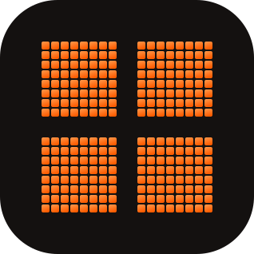
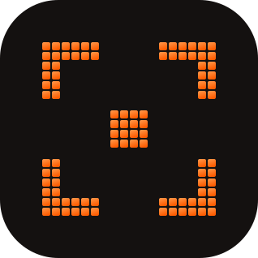
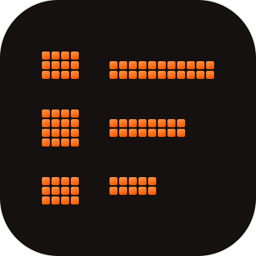
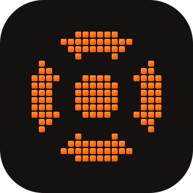
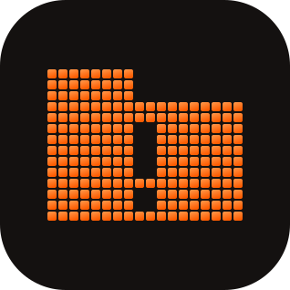

# Accel — Module Sections & Benefits

Ready-to-use website copy for the seven Accel modules worth showcasing, each
with an animated icon. Structured to match the Dropship-style layout: icon +
name + description + CTA on the left, product screenshot on the right, then a
three-column benefit row underneath.

For the fuller pitch copy, feature bullets, and screenshot direction, see
[WEBSITE-MODULE-SHOWCASE.md](WEBSITE-MODULE-SHOWCASE.md).

---

## 1. Live Monitoring



**One console, every site, live.**

Add every camera across every site to a single console. Watch one feed
closely, forty at once, or build a purpose-made ops wall — and keep the whole
team looking at the same thing.

| No blind spots | One wall for the whole team | The feeds that matter stay put |
|---|---|---|
| Every site, every camera, in one console. Watch one feed closely or forty at once without switching tools. | Layouts are saved organization-wide, so every operator on shift sees the same view instead of a personal one trapped in their own browser. | Pin your priority cameras and they hold the top spot across every filter, page, and view mode. |

---

## 2. Detection Feed



**Every alert comes with its reasoning attached.**

A live feed of AI-detected events, each one carrying a written explanation of
what the model saw and the confidence numbers behind it — so your team can
judge an alert in seconds instead of replaying footage.

| AI that explains itself | Clear the queue in bulk | Dismissals aren't dead ends |
|---|---|---|
| Every event comes with a written description of what the model actually saw, plus the confidence numbers behind it. No black box, no blind trust. | Select a whole batch of events and escalate, link, or dismiss them in a single action instead of clicking through one row at a time. | Tag why a detection was wrong and that reason feeds straight back into model tuning, so the same false positive stops coming back. |

---

## 3. Run Analysis


**Prove a model works before it ever touches a live camera.**

Upload footage, pick a detection model and a vision-language model, and get a
scored, step-by-step compliance verdict back — the proving ground your models
pass through before deployment.

| Test before you trust | A score, not a hunch | Pay only for what you analyze |
|---|---|---|
| Score a model against real footage before it ever touches a live camera. Find out it doesn't work in a sandbox, not in an incident review. | Every run returns a 0–100% compliance score with a step-by-step pass/fail log you can file, export, and defend. | Metered by footage minute with a free trial allowance included. No hidden compute bills, no annual commit to run your first test. |

---

## 4. Rules Library



**Configure detection logic without writing a line of code.**

Build the logic that decides what counts as an incident out of visual blocks —
trigger, zone, duration, schedule, action — and see it written back to you in
plain English before you save.

| No code required | Read it back in plain English | Know before you go live |
|---|---|---|
| Build detection logic out of visual blocks. If you can describe the rule out loud, you can build it yourself — no engineer, no ticket, no wait. | A live sentence translates your blocks as you build them, so what you configured is exactly what you can verify before saving. | A 7-day trigger-rate preview shows how often the rule would have fired on real history, so nothing floods the feed on day one. |

---

## 5. AI Model Lifecycle



**From raw model file to live camera, one pipeline.**

Chain models into an ordered verification sequence, deploy them to specific
cameras and zones through a guided wizard, and watch their health from the
same place.

| Check every step, not just one | Rules that write themselves | Catch a failing model early |
|---|---|---|
| Chain models into an ordered sequence so a single clip gets verified against your whole SOP — chin strap, helmet, bolt group — in order, every time. | Upload a model file and Accel extracts candidate detection rules from it automatically. Accept them as-is or tune them first. | Health is tracked per camera and rolled up per model, so a deployment quietly degrading on one feed never hides behind a green "Active" label. |

---

## 6. Incident Cases



**Every alert has somewhere to go.**

Turn a detection into an investigation with an owner, a severity, and an SLA
clock — and track it through to a documented resolution.

| Every alert gets an owner | One incident, one case | Nothing gets buried |
|---|---|---|
| Escalate a detection into a case with an assignee, a severity, and an SLA clock attached from the moment it opens. | Related detections across different cameras and times roll into a single investigation instead of scattering across the queue as separate alerts. | Open, In Review, Action Taken, Closed — with a standing critical count so the urgent work stays visible at the top. |

---

## 7. Site & Device Management


**It manages your hardware, not just your video.**

Map your real buildings, define the zones the AI watches, and keep every
camera and recorder healthy from one roster.

| Zones drawn on your real floor plan | Cameras and recorders, one roster | Footage ready to hand over |
|---|---|---|
| Upload the actual building layout and draw the areas the AI watches — armoury, checkpoint, loading bay — once, then use them everywhere else in the product. | Every camera and NVR shares a single health signal, sorted worst-first, so whatever needs attention is already at the top of the list. | Export recordings as a ZIP, an MP4 pack, or a manifest file when compliance or law enforcement asks — no screen-recording workarounds. |

---

## The icon set

Seven animated SVGs in `website-assets/icons/`, one per section above. Open
`website-assets/preview.html` in a browser to see them all animating on light
and dark backgrounds.

| File | Module | Symbol | Motion |
|---|---|---|---|
| `live-monitoring.svg` | Live Monitoring | 2×2 video wall | Tiles light in sequence, like feeds going live |
| `detection-feed.svg` | Detection Feed | Bounding-box brackets locking onto a target | Radar ping outward from the centre |
| `run-analysis.svg` | Run Analysis | Shield with a checkmark knocked out | Sweeps bottom to top, like a scan completing |
| `rules-library.svg` | Rules Library | Stacked rule rows | Rows fill top to bottom, like a list building |
| `model-lifecycle.svg` | AI Model Lifecycle | Segmented ring around a model core | Rotates around the ring |
| `incident-cases.svg` | Incident Cases | Case folder with an alert mark | Sweeps left to right |
| `site-devices.svg` | Site & Device Management | Map pin | Radiates out from the pin head |

### Specs

- **Canvas** 320 × 320, `viewBox="0 0 320 320"` — scales cleanly to any size;
  88–120px is the sweet spot for a section header
- **Grid** 20 × 20 dots, 10px squares on a 12px pitch, 40px padding
- **Tile** `#141110`, 72px corner radius — sits on light or dark page
  backgrounds without a halo
- **Dots** vertical gradient `#FF9A4D → #FE5C01` (Accel orange)
- **Loop** 2.8s, seamless, no start or end frame — safe to leave running
- **Accessibility** each file carries a `<title>` for screen readers and
  honours `prefers-reduced-motion`, falling back to a static state

### Changing the colour

Each file defines its own gradient near the top. To re-theme, replace the two
stop colours:

```xml
<linearGradient id="g-run-analysis" x1="0" y1="0" x2="0.35" y2="1">
  <stop offset="0" stop-color="#FF9A4D"/>
  <stop offset="1" stop-color="#FE5C01"/>
</linearGradient>
```

The tile background is the `.tile-<slug>` rule in the same file.

### Using them

Inline the SVG or reference it with `` — both keep the animation. CSS
animation inside an `` tag works in every current browser:

```html

```

One caveat: some markdown hosts (GitHub included) strip embedded CSS from
SVGs, so the icons render static in a README preview but animate correctly on
a real web page.
