# Perks of Accel

Section copy for a Dropship-style perks grid — six cards, three across, each
with a title, a short description, and an animated illustration.

**Section heading:** Perks of Accel
**Section subhead:** Built for the people who are accountable for what happens
on site — not for a demo reel.

Illustrations live in `website-assets/perks/`. Open
`website-assets/perks-preview.html` in a browser to see the whole grid
animating.

---

## 1. Handsfree monitoring


Accel watches every feed continuously and only interrupts you when something
matters. Nobody has to sit and stare at a wall of screens hoping to catch it
live.

`website-assets/perks/handsfree-monitoring.svg`

---

## 2. Every alert explains itself


Each detection arrives with a written description of what the model saw and
the confidence numbers behind it. Your team can judge an alert in seconds
instead of scrubbing footage to work out what happened.

`website-assets/perks/explainable-alerts.svg`

---

## 3. Proven before it goes live


Score any model against real footage and get a step-by-step pass/fail
breakdown before it runs on a single camera. You find out it doesn't work in a
sandbox, not in an incident review.

`website-assets/perks/proven-before-live.svg`

---

## 4. No engineer required


Your security lead builds the rules — trigger, zone, duration, action — from
visual blocks and reads them back in plain English before saving. No ticket,
no dev sprint, no waiting on someone else's backlog.

`website-assets/perks/no-engineer.svg`

---

## 5. Keep the cameras you have



Accel connects to the cameras and recorders already installed on site over
standard RTSP. No rip-and-replace, no hardware order standing between you and
a working system.

`website-assets/perks/existing-cameras.svg`

---

## 6. Every site, one console



Headquarters, warehouse, port terminal — every site reports into a single
login, with layouts shared across the team so everyone on shift is looking at
the same thing.

`website-assets/perks/one-console.svg`

---

## Spare card — Audit-ready by default


Every action across cases, cameras, models, and users is logged, filterable,
and exportable. When someone asks what happened and who signed off, the answer
is already written down.

`website-assets/perks/audit-ready.svg`

Swap this in for any of the six above — it's the strongest card for a
compliance-led or public-sector audience, where the audit trail is often the
deciding factor rather than the AI.

---

## The illustration set

Seven animated SVGs, drawn to sit on a white or near-white card the way the
reference layout does.

| File | Card | What it shows |
|---|---|---|
| `handsfree-monitoring.svg` | Handsfree monitoring | Camera scanning on its own, alert card arriving |
| `explainable-alerts.svg` | Every alert explains itself | Clip with a bounding box drawing itself, reasoning lines filling in, confidence bar |
| `proven-before-live.svg` | Proven before it goes live | Score dial filling to a pass, checkmark drawing, step list ticking off |
| `no-engineer.svg` | No engineer required | Rule blocks snapping into place under a cursor |
| `existing-cameras.svg` | Keep the cameras you have | Dome, bullet, and NVR feeding into the Accel tile |
| `one-console.svg` | Every site, one console | Site pins above a dark console, tiles going live in turn |
| `audit-ready.svg` | Audit-ready by default | Log rows filling a report, approval stamp landing |

### Specs

- **Canvas** 400 × 300, `viewBox="0 0 400 300"` — scales to any card width;
  set `width: 100%` and let height follow
- **Background** transparent, so the card's own background shows through
- **Palette** neutral greys `#F6F8FC → #C6CFDD` for surfaces, Accel orange
  `#FF9A4D → #FE5C01` for the one thing that matters in each scene
- **Loops** 5–6s, seamless, offset with negative delays so first paint shows
  the finished state rather than an empty frame
- **Accessibility** each carries a `<title>` and honours
  `prefers-reduced-motion`, falling back to the assembled still

### Using them

```html

```

CSS animation inside an `` works in every current browser. Inline the
SVG instead if you want to drive the animation from scroll or hover — the
class names are namespaced per file (`.pv-`, `.ne-`, `.ex-`…) so nothing
collides when several are inlined on one page.

One caveat: GitHub and some markdown hosts strip embedded CSS from SVGs, so
the previews above render static in a README but animate correctly on a real
page.
