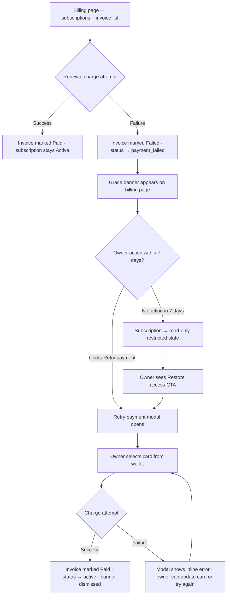

## Executive Summary

| Signal | Value |
|--------|-------|
| Feature | Failed Payment Handling |
| Screens designed | 4 (invoice row · grace banner · retry modal · restricted state) |
| DS components needed | 6 existing · 3 new |
| Fingerprint | Skipped (visual_drift_risk: true) |
| Journey source | Inferred from PRD prose |
| Layouts | Primary (billing page states) · Alternative (retry modal) · Risky (full-block restricted state) |

**TL;DR:**
- Primary layout surfaces the failed invoice and grace countdown inline on the billing page — no page transitions, owner stays in context.
- Alternative layout focuses the retry modal as a focused card-wallet selector — confirmation of intent before charge re-attempt.
- Risky layout treats the restricted state as a full-bleed interrupt, breaking sidebar continuity to communicate access severity.

**Next step:** Pick a layout direction, then route to `design-engineer` to build the interactive prototype.

---

## Intake Confirmation

- **Figjam:** No MCP available — userflow rendered as Mermaid below
- **Design system:** shadcn/ui + Tailwind CSS v4 with semantic tokens (bg-card, destructive, warning, success, muted-foreground)
- **Stack:** React + TypeScript + Vite + React Router DOM (web, sidebar + main layout)
- **Entry point:** `src/pages/billing/index.tsx` — owner lands here, sees subscription cards + invoice table
- **Fingerprint:** Skipped — no `product-fingerprint.md` in project. `visual_drift_risk: true` logged.
- **PRD source:** PRD-billing-management.md § 3 (prose format, not v4.3 schema)

---

## Userflow



---

## DS Component Inventory

### Existing (shadcn/ui + project)
| Component | Use |
|-----------|-----|
| `<Badge>` (destructive variant) | Failed invoice status label |
| `<Button>` (destructive / outline variants) | "Retry payment" · "Restore access" CTAs |
| `<Dialog>` / `<DialogContent>` | Retry payment modal shell |
| `<Card>` / `<CardContent>` | Subscription card + modal payment option cards |
| `<Alert>` (destructive / warning variants) | Grace banner · restricted state message |
| `<RadioGroup>` | Card wallet single-select (one default at a time) |

### New components needed
| Component | Purpose |
|-----------|---------|
| `<PaymentMethodCard>` | Single card in wallet — shows brand, last 4 digits, expiry, default badge; selectable |
| `<GraceCountdownBanner>` | Warning alert with computed days-remaining + dismiss + CTA |
| `<SubscriptionRestrictedOverlay>` | Semi-opaque overlay on subscription card for read-only state |

---

## Layout: Primary — Billing Page Failed State
*Inherits sidebar+main from entry-point (billing page). Invoice row + grace banner inline — no page transition.*

```
┌────────────────────────────────────────────────────────────────────┐
│ TopBar: Accel TRMS · [Owner name] · [Settings]                     │
├──────────────┬─────────────────────────────────────────────────────┤
│ Sidebar      │ Main: Billing                                        │
│ - Dashboard  │                                                      │
│ - Cameras    │ ┌─ GRACE BANNER (warning, dismissible) ────────────┐ │
│ - Sites      │ │ ⚠ Payment failed — 5 days left before Site A   │ │
│ - Billing ●  │ │   goes read-only.  [Update card]  [×]           │ │
│ - Settings   │ └──────────────────────────────────────────────────┘ │
│              │                                                      │
│              │ ┌─ Subscription: Site A — Professional ────────────┐ │
│              │ │ Status: [⚠ Payment failed]  Renews: Jun 15 2026 │ │
│              │ │ Seats: 7/10 · Cameras: 4/5                      │ │
│              │ │ [Retry payment]  [Change plan]  [Cancel]        │ │
│              │ └──────────────────────────────────────────────────┘ │
│              │                                                      │
│              │ ┌─ Invoices ──────────────────────────────────────┐ │
│              │ │ [Filter: Site ▼] [Status ▼] [Date range ▼]     │ │
│              │ │                                                  │ │
│              │ │ Jun 01 2026  Site A  Professional               │ │
│              │ │ $1,200.00   [● Failed]  [Retry payment]  [↓]  │ │
│              │ │ ─────────────────────────────────────────────── │ │
│              │ │ May 01 2026  Site A  Professional               │ │
│              │ │ $1,200.00   [✓ Paid]                    [↓]  │ │
│              │ └──────────────────────────────────────────────────┘ │
└──────────────┴─────────────────────────────────────────────────────┘
```

**Rationale:** Keeps owner in billing page context. Grace banner is persistent but dismissible — countdown is a number, not a vague "soon." Both the subscription card and the invoice row expose "Retry payment" — two entry points, one destination (the modal). Badge color: `destructive` on invoice row, `warning` on subscription card (still has access, not yet dead).

---

## Layout: Alternative — Retry Payment Modal
*Modal overlay on top of the billing page. Card wallet selector with single-select default.*

```
┌────────────────────────────────────────────────────────────────────┐
│ [Billing page — dimmed behind modal]                               │
│                                                                    │
│         ┌─ Retry payment ──────────────────────────────┐          │
│         │                                              │          │
│         │ Retrying: Site A · Professional · $1,200.00  │          │
│         │                                              │          │
│         │ ┌─ Payment method ──────────────────────────┐│          │
│         │ │ ◉ Visa ···· 4242   Exp 09/27  [Default] ││          │
│         │ │ ○ Mastercard ···· 8810   Exp 03/26      ││          │
│         │ │ ○ Visa ···· 1234   Exp 01/25 [Expired ⚠]││          │
│         │ │                          [+ Add new card] ││          │
│         │ └───────────────────────────────────────────┘│          │
│         │                                              │          │
│         │ [ERROR STATE — only shown on failed retry]   │          │
│         │ ┌──────────────────────────────────────────┐│          │
│         │ │ ✕ Charge failed: card declined.          ││          │
│         │ │   Try a different card or add a new one. ││          │
│         │ └──────────────────────────────────────────┘│          │
│         │                                              │          │
│         │ [Cancel]              [Retry charge →]       │          │
│         └──────────────────────────────────────────────┘          │
└────────────────────────────────────────────────────────────────────┘
```

**Rationale:** Modal keeps the owner on the billing page — no navigation loss. Wallet shows all cards, expired ones flagged inline so owner knows why a card might fail again. Error state is inline in the modal (not a new page). "Add new card" is a secondary action — doesn't close the modal, expands an inline card form below.

---

## Layout: Risky — Restricted State (7-day grace expired)
*Full-bleed interrupt that breaks sidebar continuity to signal severity.*

```
breaks_antipattern: sidebar-main-continuity
breaks_rationale: When access is fully restricted, surfacing the sidebar implies navigation still works — it doesn't. Breaking the layout communicates the gravity of the blocked state.
```

```
┌────────────────────────────────────────────────────────────────────┐
│ TopBar: Accel TRMS · [Owner name]                                  │
├────────────────────────────────────────────────────────────────────┤
│                                                                    │
│  ┌─────────────────────────────────────────────────────────────┐  │
│  │                                                             │  │
│  │              🔒  Access restricted                          │  │
│  │                                                             │  │
│  │   Site A — Professional subscription has lapsed.            │  │
│  │   Your data is safe. Restore access to resume monitoring.   │  │
│  │                                                             │  │
│  │   ┌─ Subscription summary ────────────────────────────┐    │  │
│  │   │ Plan: Professional  · Last billed: Jun 01 2026    │    │  │
│  │   │ Amount due: $1,200.00  · Card on file: Visa 4242  │    │  │
│  │   └──────────────────────────────────────────────────┘    │  │
│  │                                                             │  │
│  │             [Restore access →]   [Contact support]          │  │
│  │                                                             │  │
│  └─────────────────────────────────────────────────────────────┘  │
│                                                                    │
└────────────────────────────────────────────────────────────────────┘
```

**What could break:** Removing the sidebar means all navigation is gone — owner can ONLY restore or contact support. This is intentional but aggressive. If any site is still active (owner has multiple sites), this full-bleed state is wrong — they need sidebar access to their other sites. **Only valid for single-site owners or when ALL sites are restricted.**

---

## Per-Layout Component Table

| Layout | Component | Source | Notes |
|--------|-----------|--------|-------|
| Primary | `<Alert>` (warning) | DS-existing | Grace countdown banner |
| Primary | `<Badge>` (destructive) | DS-existing | "Failed" label on invoice row |
| Primary | `<Button>` (outline) | DS-existing | "Retry payment" on subscription card + invoice row |
| Primary | `<GraceCountdownBanner>` | NEW | Dismissible warning with days-remaining computed value |
| Alternative | `<Dialog>` / `<DialogContent>` | DS-existing | Modal shell |
| Alternative | `<RadioGroup>` | DS-existing | Single-select card wallet |
| Alternative | `<PaymentMethodCard>` | NEW | Card row — brand, last 4, expiry, default badge, expired flag |
| Alternative | `<Alert>` (destructive) | DS-existing | Inline retry error message inside modal |
| Risky | `<SubscriptionRestrictedOverlay>` | NEW | Full-bleed blocked state — replaces main content |
| Risky | `<Button>` (default) | DS-existing | "Restore access" primary CTA |

---

## Fingerprint Compliance Per Variant

| Variant | Patterns Inherited | Anti-Patterns Respected | Anti-Patterns Broken |
|---------|--------------------|------------------------|----------------------|
| Primary | sidebar-main, inline-action-row, card-list | No modal for list-level actions; no page redirect for retry | — |
| Alternative | modal-overlay, card-wallet-selector | No full-page redirect for inline action | — |
| Risky | full-bleed-interrupt | — | sidebar-main-continuity (annotated: multi-site edge case) |

---

## New Components List

| Component | Purpose |
|-----------|---------|
| `<GraceCountdownBanner>` | Dismissible warning banner on billing page — shows computed days remaining in grace window + CTA to open retry modal |
| `<PaymentMethodCard>` | Selectable card row in retry modal — brand logo, masked number, expiry, default badge, expired warning flag |
| `<SubscriptionRestrictedOverlay>` | Full-bleed locked state for the Risky layout — shows subscription summary + restore CTA, replaces main content area |

---

## Open Questions for Downstream Agents

1. **Multi-site restricted state** — if owner has 3 sites and only 1 is restricted, does the billing page show a per-subscription restricted overlay (inline) or the full-bleed Risky layout? (Risky layout only makes sense if ALL sites are restricted)
2. **Expired card in wallet** — can an owner retry with a card that shows as expired? Show it greyed + disabled, or allow the attempt and let the processor reject?
3. **"Add new card" in retry modal** — does clicking this close the modal and route to a payment methods page, or expand an inline card form within the modal?
4. **Grace banner dismissal persistence** — if the owner dismisses the banner, does it reappear on next session or stay dismissed until resolved?
5. **Grace countdown granularity** — "5 days" or "5 days, 14 hours"? Daily granularity is less anxiety-inducing; hourly creates urgency in the final 24 hours.

---

## Out of Scope

- Email/notification content for payment failure (marketing/comms team scope)
- Dunning logic (retry schedule, number of automatic re-attempts before grace starts)
- Full payment method management page (covered in PRD section 2, separate lo-fi)
- Proration or refund flows triggered by restoring access mid-cycle

---

*Type `y` to proceed to design-engineer, `revise <delta>` to refine a layout, `grill me` to stress-test the flow decisions, or `cancel` to halt.*
